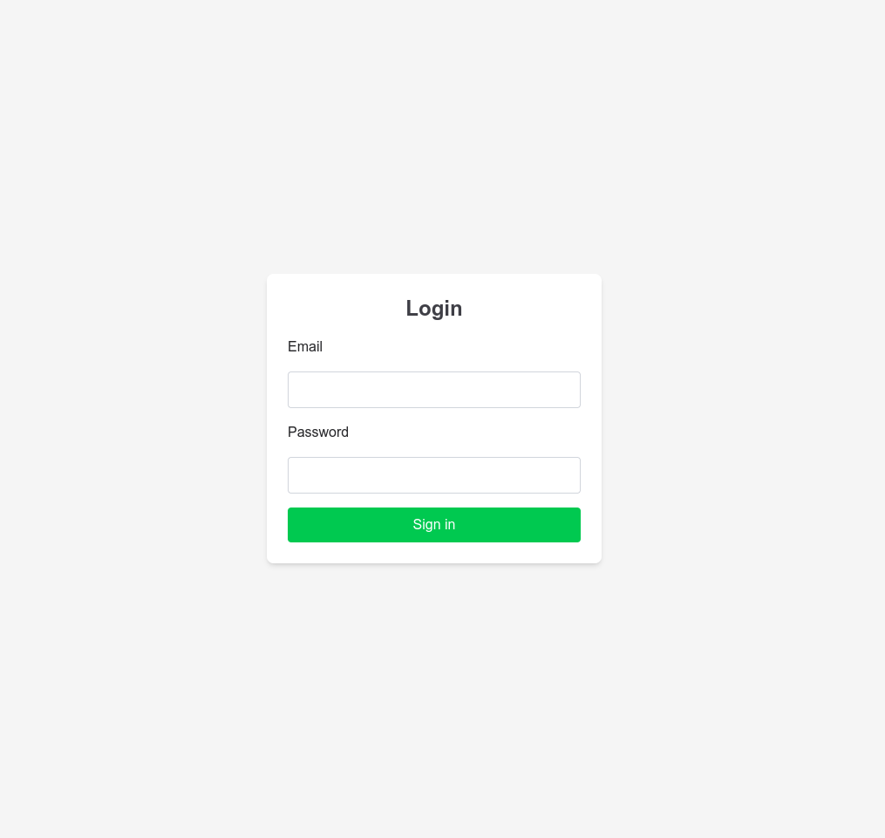
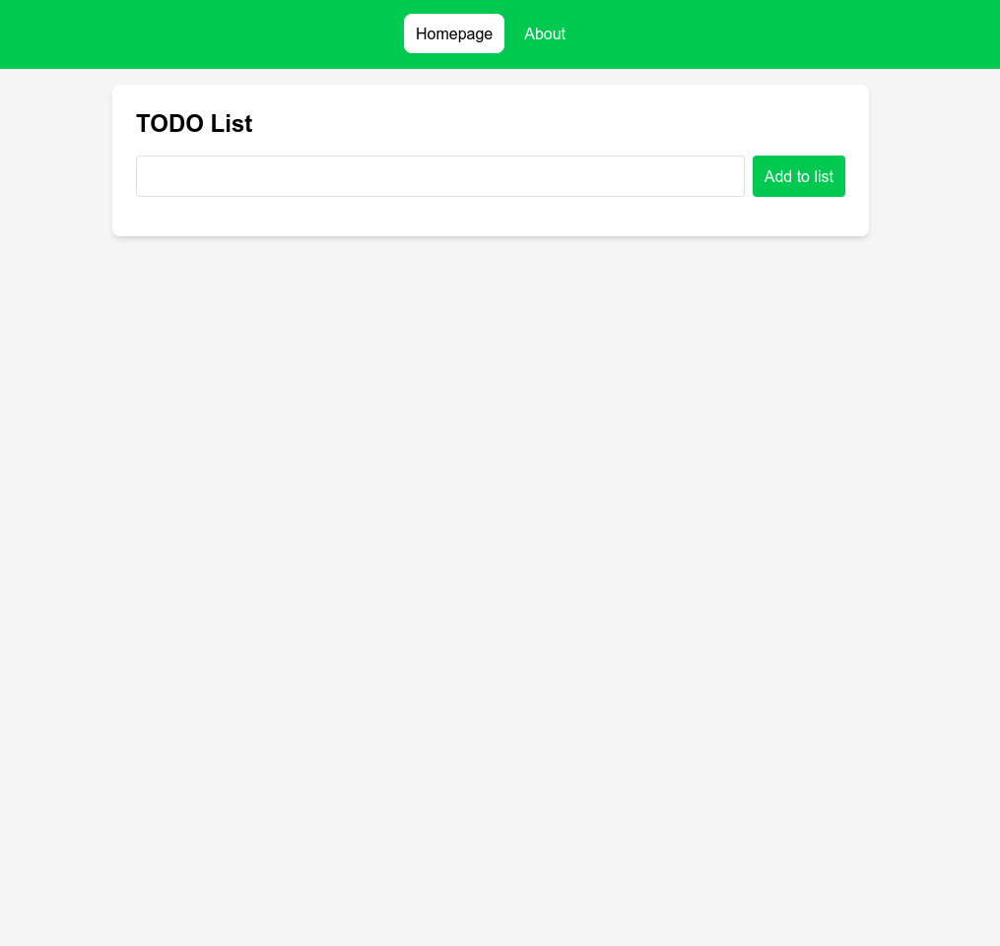
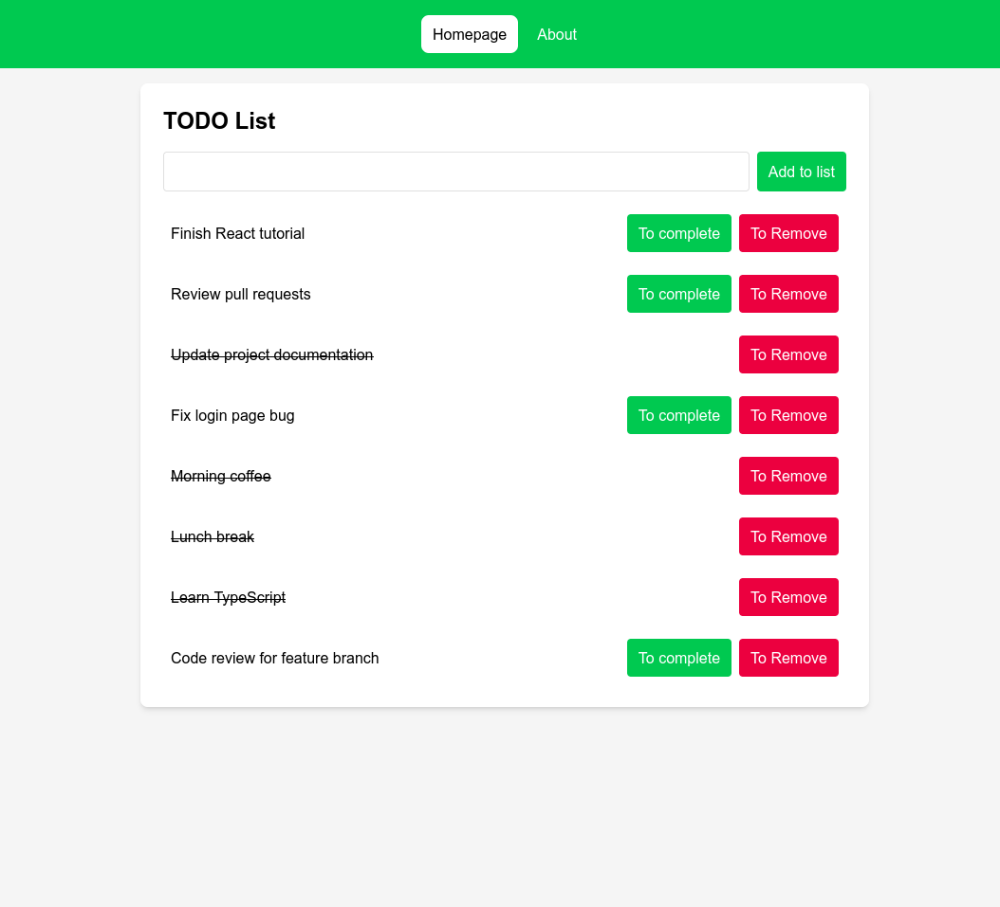

# React Vite TODO Starter

A TODO list application built with React, Vite, TypeScript, and Tailwind CSS. This project demonstrates a clean architecture with authentication, routing, and mock API integration.

## 📸 Screenshots





## ✨ Features

- **Authentication System**: Login page with form validation
- **TODO Management**: Add, complete, and remove tasks
- **Persistent Storage**: Tasks saved in localStorage via MirageJS mock server
- **Routing**: Protected routes with React Router
- **Responsive Design**: Mobile-friendly interface with Tailwind CSS
- **Type Safety**: Full TypeScript support
- **Modern Build Tool**: Lightning-fast HMR with Vite

## 🛠️ Tech Stack

- **React 19** - UI library
- **TypeScript** - Type safety
- **Vite** - Build tool and dev server
- **Tailwind CSS 4** - Utility-first CSS framework
- **React Router 7** - Client-side routing
- **Axios** - HTTP client
- **MirageJS** - Mock API server
- **ESLint** - Code linting

## 📋 Prerequisites

Before you begin, ensure you have the following installed:

- **Node.js** (version 22 or higher)
- **yarn** (recommended - this project uses yarn)

## 🚀 Getting Started

### Installation

1. Clone the repository:

```bash
git clone <your-repository-url>
cd react-vite-todo-starter
```

2. Install dependencies:

```bash
# Using yarn (recommended)
yarn install

# Or using npm (remove yarn.lock first)
npm install
```

### Development

Start the development server:

```bash
# Using yarn
yarn dev

# Or using npm
npm run dev
```

The application will be available at `http://localhost:5173`

### Build for Production

Create an optimized production build:

```bash
# Using yarn
yarn build

# Or using npm
npm run build
```

Preview the production build:

```bash
# Using yarn
yarn preview

# Or using npm
npm run preview
```

### Linting

Run ESLint to check code quality:

```bash
# Using yarn
yarn lint

# Or using npm
npm run lint
```

## 🐳 Docker Deployment

This project includes Docker support for easy deployment with a production-optimized setup using Nginx.

### Docker Architecture

The Dockerfile uses a **multi-stage build**:

1. **Builder stage**: Compiles the React app with Node.js
2. **Production stage**: Serves static files with Nginx Alpine

### Quick Start with Docker

**Build and run with Docker Compose:**

```bash
docker compose up --build
```

The application will be available at `http://localhost:8080`

**Or use Docker directly:**

```bash
# Build the image
docker build -t react-vite-todo-starter .

# Run the container
docker run -p 8080:80 react-vite-todo-starter
```

### Docker Configuration

**Dockerfile highlights:**

- Uses Node.js 22 Alpine for building
- Multi-stage build reduces final image size
- Nginx Alpine 3.23 for production serving
- Custom nginx.conf for SPA routing support
- Static asset caching enabled

**compose.yaml:**

- Container name: `react-vite-app`
- Port mapping: `8080:80` (host:container)
- Builds from current directory

**nginx.conf features:**

- SPA routing support (all routes serve `index.html`)
- Static asset caching (1 year for JS/CSS/images)
- Optimized for production serving

### Customizing Docker Setup

**Change the exposed port:**

Edit `compose.yaml`:

```yaml
ports:
  - "3000:80" # Change 8080 to your preferred port
```

### Docker Cleanup

```bash
# Stop and remove containers
docker compose down

# Remove images
docker rmi react-vite-todo-starter

# Clean up all unused Docker resources
docker system prune -a
```

## 📁 Project Structure

```
src/
├── components/          # Reusable UI components
│   ├── InputAdd.tsx    # Input field for adding TODOs
│   ├── List.tsx        # List container component
│   └── TodoItem.tsx    # Individual TODO item
├── pages/              # Page components
│   ├── Home.tsx        # Main TODO list page
│   ├── About.tsx       # About page
│   └── public/
│       └── Login.tsx   # Login page
├── shared/             # Shared utilities and layouts
│   ├── contexts/       # React contexts
│   │   └── AuthContext.tsx
│   ├── layout/         # Layout components
│   │   ├── AppLayout.tsx
│   │   └── page-layout/
│   │       └── PageLayout.tsx
│   └── services/       # API services
│       └── api/
│           └── TodoAPI.ts
├── mocks/              # MirageJS mock server
│   └── server.ts
├── App.tsx             # Main app component
├── Routes.tsx          # Route configuration
├── main.tsx            # Application entry point
└── index.css           # Global styles
```

## 🎯 How to Use

1. **Login**: Enter any email and password to access the app
2. **Add Tasks**: Type your task in the input field and click "Add to list" or press Enter
3. **Complete Tasks**: Click "To complete" to mark a task as done
4. **Remove Tasks**: Click "To Remove" to delete a task
5. **Navigation**: Use the navigation bar to switch between Homepage and About pages

## 🔧 Configuration

### Vite Configuration

The Vite server is configured to run on all network interfaces:

```typescript
server: {
  host: "0.0.0.0",
  port: 5173,
}
```

This allows you to access the app from other devices on your local network.

### Tailwind CSS

This project uses Tailwind CSS v4 with the Vite plugin. Custom theme configuration is available in `src/index.css`.

## 🧪 Mock API

The application uses MirageJS to simulate a backend API. Data is persisted in localStorage, so your TODOs will survive page refreshes.

**Available endpoints:**

- `GET /api/todos` - Fetch all TODOs
- `POST /api/todos` - Create a new TODO
- `PATCH /api/todos/:id` - Update a TODO
- `DELETE /api/todos/:id` - Delete a TODO

## Acknowledgments

- Built as a learning project for React, Vite, and Tailwind CSS
- Thanks to the open-source community for the amazing tools
